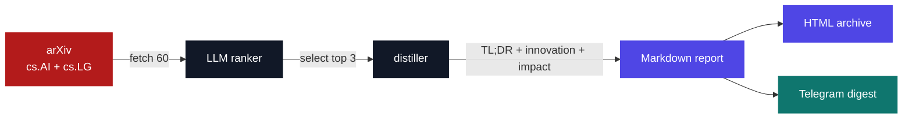

<div align="center">

# AI Paper Scout

### Research signal, without the research overload.

A small, automated pipeline that scans the newest **cs.AI** and **cs.LG** papers on arXiv, uses an OpenAI-compatible LLM to select the three most useful papers, and turns them into practical Markdown briefings.

<br />

[](https://github.com/mohabdelkarim/ai-paper-scout/actions/workflows/distill.yml)
[](https://www.python.org/)
[](https://arxiv.org/)


<br />

> **60 papers in. 3 decisions out.**
>
> Get the important ideas, the novelty behind them, and the practical reason to care, without opening 60 tabs.

</div>

## Report archive

The latest generated reports are listed below. This section is maintained automatically by `scripts/distill.py`.

<!-- REPORT_INDEX -->
| | | |
| --- | --- | --- |
| [Jun 20 · Robotics](reports/2026-06-20.md) | | |
| [Jun 19 · Large Language Models](reports/2026-06-19.md) | | |
| [Jun 17 · Vision-Language Models](reports/2026-06-17.md) | | |
| [Jun 15 · Medical Multimodal LLMs](reports/2026-06-15.md) | | |
| [Jun 13 · Vision-Language Models](reports/2026-06-13.md) | | |
| [Jun 09 · Reinforcement Learning](reports/2026-06-09.md) | | |
| [Jun 07 · Code Language Models](reports/2026-06-07.md) | | |
| [May 31 · Large Language Models](reports/2026-05-31.md) | | |
| [May 30 · Robotics](reports/2026-05-30.md) | | |
<!-- REPORT_INDEX -->

## Why this exists

AI research moves faster than most people can read. Paper Scout turns that stream into a compact weekly signal:

| Input | Reasoning | Output |
| --- | --- | --- |
| The newest 60 papers from `cs.AI` and `cs.LG` | LLM ranking followed by structured distillation | Three readable reports with direct arXiv links |

Each selected paper is reduced to the questions that matter in practice:

<ol>
  <li><strong>TL;DR</strong>: what the paper does</li>
  <li><strong>Key innovation</strong>: what is genuinely new</li>
  <li><strong>Why it matters</strong>: what the idea could enable</li>
  <li><strong>Tags and source</strong>: how to find and explore it later</li>
</ol>

## What you get

<div align="center">

| Signal | What Paper Scout does for you |
| :---: | --- |
| `01` | Fetches the latest papers automatically from arXiv |
| `02` | Ranks candidates with any OpenAI-compatible LLM endpoint |
| `03` | Distills the top three into consistent Markdown reports |
| `04` | Builds a searchable, themeable HTML archive |
| `05` | Sends optional digests and failure alerts through Telegram |
| `06` | Records latency, token usage, retries, errors, and SLA breaches |

</div>

## The flow



## Quick start

### 1. Install

```bash
git clone https://github.com/mohabdelkarim/ai-paper-scout.git
cd ai-paper-scout

# macOS / Linux
python -m venv .venv
source .venv/bin/activate

# Windows PowerShell
python -m venv .venv
.venv\Scripts\Activate.ps1

pip install -r requirements.txt
```

Requires **Python 3.9 or newer**.

### 2. Configure an LLM provider

Copy the example file and add your key:

```bash
# macOS / Linux
cp .env.example .env

# Windows PowerShell
Copy-Item .env.example .env
```

```dotenv
LLM_API_KEY=your_api_key_here
```

The default configuration uses Groq. You can use any OpenAI-compatible provider by changing `LLM_API_BASE` and `LLM_MODEL`. No source changes required.

### 3. Run the scout

```bash
python scripts/distill.py
```

The pipeline fetches, ranks, distills, and writes a dated report to `reports/`. It also saves a health snapshot for that run.

### 4. Build the archive

```bash
python scripts/report_archive.py
```

This creates `reports/archive.html`, a standalone searchable archive that can be opened locally or published as a static file.

## Example output

```text
reports/
├── 2026-06-20.md          # three selected and distilled papers
├── 2026-06-19.md
├── health/
│   └── 2026-06-20.json    # latency, tokens, retries, SLA, errors
└── archive.html            # generated searchable archive
```

A report follows the same useful shape every time:

```markdown
## 1. Paper title

**Authors:** ...

**TL;DR:** ...

**Key Innovation:** ...

**Why It Matters:** ...

**Tags:** ...

**Link:** https://arxiv.org/...
```

## Automation

The repository is ready for GitHub Actions:

| Workflow | Schedule | Purpose |
| --- | --- | --- |
| `distill.yml` | Thursdays at `09:00 UTC` | Generate reports, rebuild the archive, and commit changes |
| `security.yml` | Mondays at `08:00 UTC` | Run Trivy vulnerability and secret scans |

You can also start the distillation workflow manually from the **Actions** tab using `workflow_dispatch`.

To enable the scheduled run, add these repository secrets:

<ol>
  <li><code>LLM_API_KEY</code>: required</li>
  <li><code>LLM_API_BASE</code>: optional provider endpoint</li>
  <li><code>LLM_MODEL</code>: optional model name</li>
  <li><code>TELEGRAM_BOT_TOKEN</code>: optional notifications</li>
  <li><code>TELEGRAM_CHAT_ID</code>: optional notifications</li>
</ol>

## Telegram digests

Set both Telegram variables to receive a compact digest after each run:

```dotenv
TELEGRAM_BOT_TOKEN=your_bot_token
TELEGRAM_CHAT_ID=your_chat_id
```

The message includes the selected papers, their summaries, source links, pipeline health, and a direct link back to this repository. If a run fails, Paper Scout sends a failure alert with the repository link when Telegram is configured. Leaving either variable blank safely disables notifications.

## Configuration reference

| Variable | Required | Default | Purpose |
| --- | :---: | --- | --- |
| `LLM_API_KEY` | Yes |  | API key for the selected LLM provider |
| `LLM_API_BASE` | No | `https://api.groq.com/openai/v1` | OpenAI-compatible API base URL |
| `LLM_MODEL` | No | `llama-3.3-70b-versatile` | Model used for ranking and distillation |
| `TELEGRAM_BOT_TOKEN` | No |  | Telegram bot token |
| `TELEGRAM_CHAT_ID` | No |  | Destination chat ID |

## Reliability by design

The pipeline is designed to produce useful output even when one dependency misbehaves:

<ol>
  <li>Existing reports are not duplicated.</li>
  <li>Rate-limited API calls retry up to three times with exponential backoff.</li>
  <li>Ranking failures fall back to the first available papers.</li>
  <li>A failed individual distillation gets a fallback summary while the other papers continue.</li>
  <li>Telegram is optional and never blocks report generation.</li>
  <li>Health data is saved for both successful and failed pipeline runs.</li>
</ol>

### Health metrics

Each run writes `reports/health/YYYY-MM-DD.json` with:

| Metric | What it tells you |
| --- | --- |
| Step latency | Time spent fetching, ranking, and distilling |
| SLA breaches | Whether a step exceeded its configured threshold |
| Token usage | Tokens used per step and across the run |
| Retry count | How often transient API failures occurred |
| Errors | Step-level failures and their context |

## Project map

```text
ai-paper-scout/
├── .github/workflows/
│   ├── distill.yml          # scheduled research pipeline
│   └── security.yml         # weekly Trivy scan
├── scripts/
│   ├── distill.py           # fetch → rank → distill → report → notify
│   └── report_archive.py    # Markdown reports → searchable HTML
├── reports/
│   ├── YYYY-MM-DD.md        # generated paper briefings
│   ├── health/              # generated pipeline metrics
│   └── archive.html         # generated report browser
├── .env.example             # configuration template
├── requirements.txt         # pinned Python dependencies
└── README.md
```

## Troubleshooting

| Symptom | Check |
| --- | --- |
| No papers are fetched | Confirm internet access to `export.arxiv.org` and reinstall `arxiv` dependencies |
| LLM request fails | Verify `LLM_API_KEY`, `LLM_API_BASE`, and `LLM_MODEL` match your provider |
| Telegram is silent | Confirm both Telegram variables are set and the bot can message the target chat |
| Scheduled workflow does not run | Enable GitHub Actions and check the workflow's UTC schedule |
| README report list does not update | Keep exactly two `REPORT_INDEX` markers in this file |

<div align="center">

Built for curious engineers who want to spend less time searching and more time building.

[Explore the reports](reports/) · [View the workflow](.github/workflows/distill.yml) · [Open an issue](https://github.com/mohabdelkarim/ai-paper-scout/issues)

<sub>Created by <a href="https://github.com/mohabdelkarim">@mohabdelkarim</a></sub>

</div>
